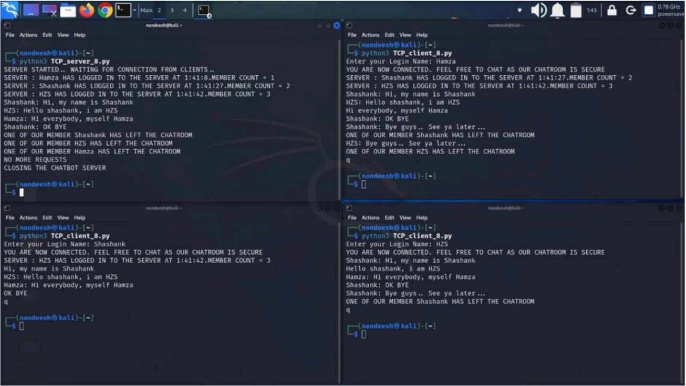

# Arithmetic Client-Server System Using TCP Sockets

## Overview
This project involves designing and implementing a Client-Server system that uses TCP sockets to enable communication between a client and a server. The client initiates communication, sends arithmetic operation requests, and receives computed results from the server.

## Functionality

### Client
1. **Initiates Communication**: The client starts by sending its name to the server. This name is remembered by the server for the entire communication session.
2. **User Input**: The client runs in an infinite loop where it accepts a line of input from the user. The input is expected to be a string consisting of two numbers and a simple arithmetic operation (e.g., "12 + 42", "3.24 - 45", or "4.5 / -6").
3. **Input Validation**: If the input is not correctly formatted, a warning is displayed to the user. If the input is valid, the client sends this string to the server.
4. **Receive and Display Result**: The client receives the computed result from the server and displays it.
5. **End Session**: If the user inputs 'q', the client sends this signal to the server to end the session, terminates the connection, and prints "Session ended".

### Server
1. **Set Up Server**: The server creates a TCP socket, binds it to a specific host and port, and listens for incoming connections.
2. **Accept Connection**: Upon accepting a connection from the client, the server receives and prints the client's name.
3. **Process Requests**: The server runs an infinite loop to continuously receive requests from the client. For each request, it parses the received arithmetic operation, computes the result, sends it back to the client, and prints the operation and result.
4. **End Session**: If the received message from the client is 'q', the server terminates the connection, prints "Session ended", and closes the connection socket.

## Code Description
### Server Program
- **Socket Creation**: The server creates a TCP socket using `socket.socket()` with `AF_INET` address family and `SOCK_STREAM` socket type.
- **Binding**: It binds the socket to a specific host and port using `bind()`.
- **Listening**: The server listens for incoming connections using `listen()` with a specified maximum number of queued up clients.
- **Accept Connection**: Upon accepting a connection using `accept()`, it receives the client's name and prints it.
- **Infinite Loop**: The server enters an infinite loop to continuously receive requests from the client.
  - **Parse and Compute**: For each request, it parses the received arithmetic operation, computes the result, sends it back to the client, and prints the operation and result.
  - **End Session**: If the received message from the client is 'q', the server terminates the connection and prints "Session ended".
- **Close Connection**: Finally, it closes the connection socket.

### Client Program
- **Socket Creation**: The client program creates a TCP socket similar to the server.
- **Connecting**: It connects to the server using `connect()` with the server's hostname and port.
- **Send Name**: It sends its name to the server.
- **Infinite Loop**: The client enters an infinite loop to continuously prompt the user to input arithmetic operations.
  - **Send Operation**: For each valid input, it sends the operation string to the server.
  - **Receive Result**: It receives the result from the server and prints it.
  - **End Session**: If the user inputs 'q', the client sends this signal to the server and terminates.
- **Close Socket**: It closes the socket after the session ends.

## Conclusion
This project demonstrates the implementation of a basic Client-Server system using TCP sockets in Python, where the client and server can communicate, process arithmetic operations, and handle session termination gracefully.

# Multi-Client Chat Room System 

## Overview
This project involves designing and implementing a multi-client chat room system. The client process acts as a chat window, allowing users to send and receive messages from other clients via the server. The server manages the chat room, keeping track of connected clients and broadcasting messages to all clients.

## Functionality

### Client
1. **Login**: The client prompts the user to enter their login name and sends a login request to the server with this name.
2. **Message Handling**: The client creates a separate thread to continuously receive messages from the server and display them to the user.
3. **User Input**: In the main thread, the client continuously prompts the user for input, sends the input messages to the server, and displays them in the chat window.
4. **End Session**: If the user inputs 'q', indicating the desire to quit, the client sends this signal to the server and terminates.

### Server
1. **Set Up Server**: The server creates a TCP socket to listen for incoming connections from clients.
2. **Track Clients**: It maintains lists of connected clients and their names.
3. **Handle Connections**: The server continuously listens for new connections and handles each client connection in a separate thread.
4. **Client Join**: Upon receiving a new connection, the server receives the client's login name and broadcasts a message to all clients about the new client joining the chat room.
5. **Message Broadcasting**: The server continuously receives messages from each client and broadcasts them to all other clients.
6. **Client Quit**: If a client sends 'q', indicating the desire to quit, the server broadcasts a message to all clients about the client leaving the chat room and closes the connection.
7. **Server Termination**: The server terminates when there are no more clients connected.

## Code Description

### Client Program
- **Login Name**: The client program prompts the user to enter their login name.
- **Establish Connection**: It establishes a connection with the server and sends the login name.
- **Receive Messages**: It creates a separate thread to continuously receive messages from the server and display them to the user.
- **User Input**: In the main thread, it continuously prompts the user for input, sends the input messages to the server, and displays them in the chat window.
- **Quit Signal**: If the user inputs 'q', indicating the desire to quit, it sends this signal to the server and terminates.

### Server Program
- **Socket Creation**: The server program creates a TCP socket to listen for incoming connections from clients.
- **Track Clients**: It maintains lists of connected clients and their names.
- **Handle Connections**: It continuously listens for new connections and handles each client connection in a separate thread.
- **New Client**: Upon receiving a new connection, it receives the client's login name and broadcasts a message to all clients about the new client joining the chat room.
- **Broadcast Messages**: It continuously receives messages from each client and broadcasts them to all other clients.
- **Client Quit**: If a client sends 'q', indicating the desire to quit, it broadcasts a message to all clients about the client leaving the chat room and closes the connection.
- **Server Termination**: The server terminates when there are no more clients connected.

## Conclusion
This project demonstrates the implementation of a multi-client chat room system using TCP sockets in Python, where multiple clients can communicate simultaneously, and the server handles the management and broadcasting of messages in the chat room.

